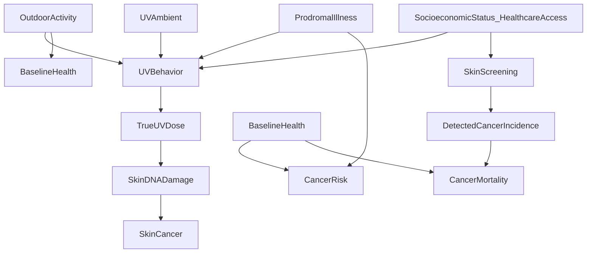

# UV & Cancer — Methods (How we evaluate evidence)

## Purpose

This page defines:
- what counts as evidence in this project
- how we avoid common causal-inference errors in UV research
- how we apply **Evidence: VeryHigh → VeryLow** tags (including to anecdotes)

## Definitions (use consistently)

- **Association vs causation**: an association is a statistical relationship; causation implies that intervening on the exposure would change the outcome.
- **Confounder**: a variable that influences both exposure and outcome, creating a spurious association.
- **Mediator**: a variable on the causal pathway from exposure to outcome (e.g., UV → vitaminD → downstream biology).
- **Effect modifier**: a variable that changes the size/direction of an effect (e.g., skin type/MC1R genotype modifying UV → skin cancer risk).
- **Reverse causation**: disease (or prodromal illness) changes exposure (e.g., people with illness go outdoors less).
- **Measurement error**: mismeasured exposure/outcome (e.g., ambient UV at residence as a proxy for personal UV dose).
- **Surveillance / detection bias**: differences in diagnosis rates due to screening or healthcare access rather than true incidence (especially relevant for skin cancer).

## Evidence sources we allow (and their typical failure modes)

- **Mechanistic biology** (molecules/cells/animal models)
  - Strength: plausibility, pathway constraints, signatures.
  - Failure modes: translation to human endpoints; unrealistic exposure dosing; species differences.
- **Observational epidemiology** (cohorts/case-control; ambient UV proxies; self-report)
  - Strength: real-world outcomes.
  - Failure modes: confounding, exposure misclassification, reverse causation, surveillance bias.
- **Randomized trials** (typically vitamin D supplementation; rarely UV exposure)
  - Strength: reduces confounding.
  - Failure modes: wrong intervention (vitamin D is not “UV”); insufficient duration/latency; baseline sufficiency; adherence; bolus vs daily differences.
- **Mendelian randomization (MR)**
  - Strength: reduces confounding/reverse causation for genetically proxied exposures.
  - Failure modes: pleiotropy; instrument strength; linearity assumptions; mismatch between lifelong genetic exposure and short-term interventions; UV-related pathways entangled with pigmentation traits.
- **Case reports / anecdotes** (truck driver face, sunscreen neck, “curative UV” stories)
  - Strength: generates hypotheses; can reveal missed confounders; can motivate targeted study.
  - Failure modes: selection bias; unknown denominators; uncontrolled co-interventions; narrative drift; no counterfactual.

## Evidence-quality tags (operational rules)

We tag *specific statements*, not entire pages.

- **Evidence: VeryHigh**
  - Multiple independent lines converge (e.g., mechanistic + tumor-genome signatures + consistent human patterns and/or replicated intervention evidence).
  - Competing explanations are unlikely to explain away the direction of effect.
- **Evidence: High**
  - Strong human evidence and/or strong mechanism; limitations exist but are bounded and explicitly stated.
- **Evidence: Moderate**
  - Suggestive signal with meaningful confounding/indirectness remaining, *or* strong mechanism without definitive human corroboration.
- **Evidence: Low**
  - Sparse/heterogeneous evidence; large sensitivity to modeling choices; major measurement limitations.
- **Evidence: VeryLow**
  - Anecdotes, ecological correlations, uncontrolled reports, or mechanistic speculation without direct support.

### Special rule for anecdotes

Anecdotes are included in **Evidence** in the relevant section, but default to:
**Evidence: VeryLow** unless there is a well-documented chain (records, timing, dose, outcome verification) and some form of replication or structured series.

## How we handle “UV is protective” claims (causal-inference checklist)

When a paper/report claims “higher UV exposure is associated with lower cancer risk/mortality,” we explicitly check:
- **Exposure definition**: ambient UV vs personal dose; UVA vs UVB; lifetime vs recent; intermittent burns vs chronic.
- **Endpoint**: incidence vs mortality; stage; subtype specificity.
- **Confounding**: outdoor physical activity, BMI, smoking, socioeconomic status, occupational class, healthcare access.
- **Reverse causation**: preclinical disease reducing outdoor time.
- **Surveillance bias**: more healthcare contact → more diagnoses (esp. melanoma).
- **Mediation confusion**: vitamin D vs non–vitamin D pathways vs “healthy outdoor” proxies.
- **Robustness**: sensitivity analyses; negative controls; stratified analyses by behavior and skin type; replication across cohorts and geographies.

## Canonical confounding model (how false “protective UV” can arise)

The diagram below shows one common way an apparent protective association can be generated without UV being causally protective for the cancer endpoint.

Interpretation notes:
- If **OutdoorActivity/BaselineHealth** drives both more sun exposure and lower mortality risk, “UV looks protective” even if it is not the causal driver.
- **Screening** can inflate detected incidence (especially for early melanoma), altering incidence patterns independent of biology.
- For skin cancers, a causal path from **TrueUVDose → SkinDNADamage → SkinCancer** can coexist with non-causal (confounded) inverse associations for other endpoints.

## How we treat mechanisms vs outcomes

- Mechanisms can make a claim **more plausible** and constrain what effects should look like (e.g., UVA-heavy vs UVB-heavy predictions).
- Mechanisms alone do not establish direction of human outcomes; human outcomes can be dominated by confounding and measurement error.
- Conversely, observational outcomes without plausible mechanisms are treated cautiously (especially if effect sizes are small and sensitive).

## Minimal citation discipline

In the generated pages:
- Any strong statement (“UV causes X”, “vitamin D reduces Y”) must be accompanied by a citation.
- If we include a low-quality claim (e.g., anecdote), we explicitly label:
  - **Evidence: VeryLow**
  - what data is missing
  - what would validate or falsify it

