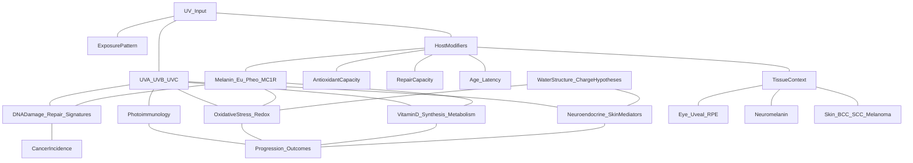

# Mechanism families M2 and M3

---

### Proposed mechanism family M2: melanin–water coupling as a dominant energy mechanism (Herrera-style)

Herrera-style claims place melanin upstream of canonical metabolism via reversible water dissociation/reformation. If true at scale, it implies:
- measurable **H₂ and O₂ flux** under irradiation,
- stoichiometry tied to absorbed energy,
- and isotope-traceable signatures.

These are quantitative constraints, not philosophical ones.

#### What contradicts “dominant water splitting” (and why)
As a dominant physiological energy mechanism, large-scale in vivo water splitting is tightly constrained by energy accounting and stoichiometry.

If tissues were performing a reaction like \(2H_2O \rightarrow 2H_2 + O_2\) at meaningful rates, several consequences are difficult to avoid:
- **Energy budget**: water splitting is energetically costly; a dominant pathway must account for where the energy comes from (photon flux absorbed) and where it goes (work + heat), at magnitudes comparable to known metabolic rates.
- **Gas flux**: a dominant pathway implies detectable production/handling of **O₂** and **H₂** at scales that should measurably alter local tissue oxygenation dynamics and produce measurable H₂ efflux.
- **Isotope constraints**: isotope-labeled water should lead to isotope signatures in any produced oxygen/hydrogen products in controlled settings.
- **Physiology coupling**: mainstream measurements tightly couple oxygen consumption, CO₂ production, and ATP turnover to mitochondrial oxidative phosphorylation; a dominant internal O₂ generation mechanism would disrupt or at least markedly modify these relationships.

This does not prove that “no melanin-associated photochemistry happens.” It says that the **strong form** (dominant bioenergetic engine) is inconsistent with a large body of quantitative physiology unless accompanied by corresponding measurable fluxes and signatures.

#### What would upgrade this from claim to mechanism
A minimally decisive program would require:
- controlled irradiation with explicit spectra/doses,
- direct measurement of **H₂/O₂** production (and where the gases go),
- isotope tracing to link products to water substrate,
- replication across independent labs,
- and reconciliation with whole-body metabolic accounting.

### Proposed mechanism family M3: electrophysiology-first reinterpretation (no “water school” required)
You can remove “water structure” language entirely and still ask the core question:

> Does **illumination** change **melanin-containing cells** in ways that measurably shift **Vmem/pHi/ΔΨm** and thereby bias proliferation/differentiation state?

This is compatible with conventional cell physiology if the effect size is large enough and reproducible. The “melanin as transducer” variant says the effect should:
- scale with melanin content/type and melanosome architecture,
- show an action spectrum consistent with melanin absorption,
- and be mediated by identifiable channel/pump/transport pathways.

### Ling-style association–induction (melanin-focused interpretation)

In an association–induction framing (Ling-style), the cell is treated less like a dilute aqueous solution and more like a **hydrated, ion-binding gel** whose state is set by adsorption to proteins/polymers:

- **Adsorption state**: proteins/polymers present many charged/polar sites that can bind ions and organize nearby water; changing protein conformations changes which sites are exposed.
- **K⁺ preference** (as claimed in this framing): intracellular K⁺ is treated as being stabilized by adsorption to specific sites rather than being explained primarily by membrane pumps alone.
- **Water “structure” as physiology**: the fraction of water that is strongly associated with macromolecular surfaces (and its polarization) is treated as a control variable that affects ion activity, enzyme function, and effective dielectric environment.
- **ATP as an inducer**: ATP is proposed to regulate the adsorption state of proteins (and therefore ion binding and hydration), so ATP changes act like a state switch for the gel rather than merely an energy currency.

Within that worldview, **Vmem is downstream of bulk ionic organization** (ion adsorption + hydration + effective activities), not just the immediate output of a few membrane currents.

Melanin-focused extension:
- melanin granules/melanosomes are treated as large hydrophilic/redox-active polymer surfaces whose **surface potential and protonation state** can reweight near-surface ion activity and hydration layers (especially if illumination changes charge state).
- if those shifts alter the effective activity of K⁺/Na⁺/Cl⁻ in membrane-adjacent regions, they can bias channel gating and transporter equilibria and thereby change whole-cell Vmem.

Make the Ling-style chain explicit (as proponents would state it):
1) **Energy/ATP state** sets protein adsorption states (which sites are “active” for binding ions/water).
2) Adsorption states set **how much K⁺ is bound vs free**, and the effective activities of major ions.
3) Those activities set **water association/polarization** (and cell volume/gel state).
4) The resulting activities + membrane permeabilities yield the observed **Vmem** (and pHi control).

Where melanin would plug in:
- illumination changes melanin surface potential/protonation → changes local hydration/ion activity,
- if the cell interior behaves like a coupled gel, large-area melanin interfaces could shift the global adsorption/hydration state enough to move Vmem set points.

This is a strong coupling assumption: if the cytosol behaves as a well-mixed solution with only local boundary layers, the effect should remain local and fail to propagate.

How “cancer as depolarized state” enters in a Ling-adjacent interpretation:
- cancer-like states are treated as **state transitions** in the gel (hydration/ion-binding patterns) that move cells away from a differentiated adsorption regime toward a proliferative regime,
- with depolarization as one macroscopic signature of that transition (along with altered ion distributions, water content, and pHi control).

This is not mainstream, but it supplies a specific kind of mechanistic glue: it asserts that relatively small changes at large polymer interfaces (including melanin-rich interfaces) can, in principle, propagate to cell-scale electrical and biochemical set points because the cell interior is not treated as an ideal well-mixed solution.

### EZ-style (Pollack-like) charge separation (melanin-focused interpretation)

EZ-style concepts treat hydrophilic surfaces as organizing water into charge-separated zones that are sensitive to radiant energy.

Melanin-focused extension:
- melanin-rich surfaces are both hydrophilic (structuring candidate) and strongly light-absorbing (energy input), potentially biasing local charge separation or proton distributions if the effect is large in vivo.

### Biophysical “ports” (measurable intermediates)
If this hypothesis family is true, the causal chain must pass through measurable intermediates:
- **Port A (melanosome interface)**: melanosome surface potential/charge, melanosome pH buffering, and local proton fluxes at/near melanosome membranes.
- **Port B (near-membrane microenvironment)**: pHi microdomains and near-membrane ion activity that channels/transporters actually experience.
- **Port C (Vmem and conductances)**: changes in Vmem attributable to changes in specific ionic conductances and pump currents.
- **Port D (ΔΨm)**: mitochondrial membrane potential/proton motive force changes that track (or do not track) upstream Vmem/pHi perturbations.

### Discriminating predictions (melanin-centered)

Predictions that would support a melanin-centered electrophysiology mechanism over conventional UVB-photoproduct framing:

1) **Action spectrum**: Vmem/pHi/ΔΨm effects track melanin absorption (UVA/visible-weighted), not erythema weighting; UVB-only protocols that create CPDs but minimal melanin absorption should not reproduce the effect.
2) **Melanin dependence**: effects scale with melanin content and type (eu vs pheo) and with melanosome pH/architecture, not with bulk heating.
3) **Hydration dependence**: if proton mobility/hydration state is central, effects should be sensitive to controlled manipulations of hydration/osmolarity in ways that are predictable and reversible.
4) **Geometry/localization dependence**: changing melanosome localization (perinuclear cap vs dispersed) changes electrophysiology readouts beyond what total melanin predicts.
5) **Mediation by conductances**: specific channel/pump inhibitors or genetic perturbations abolish the Vmem shift while leaving melanin and irradiation unchanged.
6) **Vmem causality**: imposing the same Vmem shift by independent means (optogenetic pumps, dynamic clamp) reproduces or blocks downstream proliferation/differentiation signatures.
7) **Herrera-specific** (strong claim): measurable H₂/O₂ flux proportional to irradiation under controlled conditions.

### What to measure (minimal test program)

- **Irradiation control**: explicit spectrum/dose with UVA/visible conditions chosen to match melanin absorption vs UVB conditions chosen to match CPD formation; strict temperature control.
- **Melanin state**: melanin content/type (eu vs pheo), melanosome number/size/localization, melanosome pH (where measurable).
- **Vmem (direct)**: patch clamp where feasible; ion-selective approaches; population voltage dyes as secondary readouts.
- **Vmem (mechanism)**: quantify conductances/currents and pump contributions (pharmacology + genetics) rather than only reporting “voltage changed.”
- **pHi microdomains**: cytosolic pH sensors; near-membrane pH indicators; perturb bicarbonate buffering and Na⁺/H⁺ exchange to test mediation.
- **ΔΨm and mitochondrial coupling**: ΔΨm dyes/sensors; mitochondrial Ca²⁺ indicators; test whether ΔΨm shifts are downstream of Vmem/Ca²⁺ changes.
- **Separation from DNA damage**: quantify CPDs/oxidative lesions in the same conditions to test whether electrophysiology changes occur when photoproduct load is held constant.
- **Perturbation tests**: channel blockers, pump inhibitors, optogenetic Vmem manipulation, and melanosome localization perturbations to test necessity/sufficiency.

---

## Mechanism map (non-causal “topic map”)



### Quantitative scaffold (plain)

This chain becomes quantitative if you can map photon absorption into an interface state variable that persists long enough to change a set point.

1) Depth-attenuated irradiance:

```text
I_lambda(z) ≈ I_lambda,0 * exp( -mu_eff(lambda) * z )
```

2) Photon absorption rate in melanin (conceptual form):

```text
n_abs_dot(z) ≈ ∫ [ I_lambda(z) * mu_a_mel(lambda) ] / (h*c/lambda)  dλ
```

3) Absorption → interface state variable (surface charge / protonation proxy):

```text
dσ/dt = q * φ * n_abs_dot  -  σ/τ
```

Where:

- σ is an effective surface charge density (or equivalent interface state variable)
- φ is “charges or protons moved per absorbed photon” (effective yield)
- τ is the relaxation time of that interface perturbation

4) Screening constraint:

- At physiological ionic strength, Debye screening implies that electrostatic effects decay over ~1 nm. The coupling therefore has to act through near-surface microenvironments and/or through global modulators (pHi, Ca2+, trafficking), not through a long-range static electric field.

5) Set point constraint:

- A measurable ΔVmem requires a sustained change in the dominant set-point controllers (conductances in the permeability parameterization; adsorption/interface state in the adsorption parameterization). If σ relaxes too fast (small τ) or φ is too small, the downstream ΔVmem averages to ~0.

### Falsifiers

- action spectrum: effects track melanin absorption, UVA and visible, not erythema weighting
- mediation: blocking specific conductances, transporters, or pumps removes the Vmem, pHi, or ΔΨm shift without changing irradiation
- geometry: changing melanosome localization changes the electrophysiology readout beyond total melanin